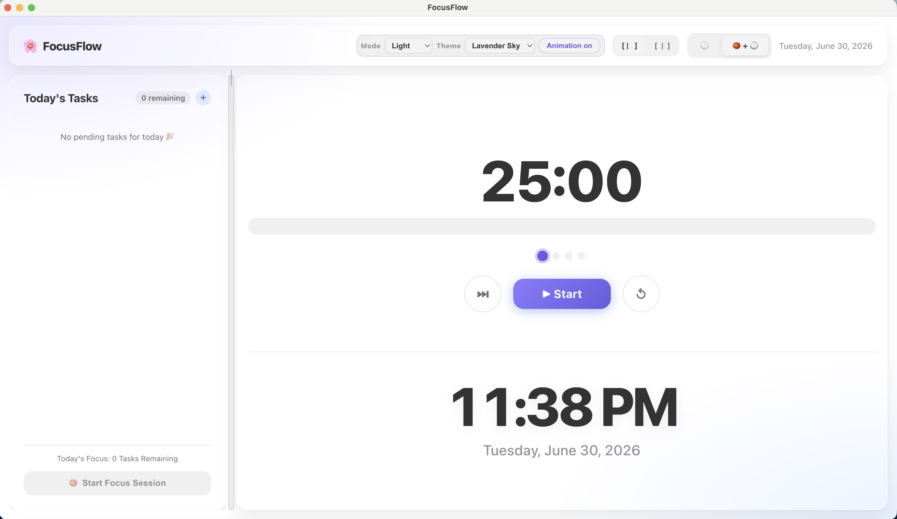

# FocusFlow - Productivity App

A desktop productivity application built with Electron, React, and TypeScript featuring Pomodoro timer and task management.

# Installation

## For End Users

Download the latest installer from the GitHub Releases page.

| Platform | Installer |
|----------|-----------|
| macOS |  |

The application includes its own local SQLite database and will automatically create the required database on first launch.

No additional software or database installation is required.
# FocusFlow



## Development Setup

### Prerequisites
- Node.js (v16 or higher)
- npm

### Installation

```bash
npm install
```

### Running the Application

Development mode (with hot reload):
```bash
npm run electron:dev
```

This will:
1. Start the Vite dev server on http://localhost:5173
2. Launch the Electron application
3. Open DevTools automatically for debugging

### Project Structure

```
my-productivity-app/
├── electron/           # Electron main process code
│   ├── main.ts        # Main process entry point
│   └── preload.ts     # Preload script for secure IPC
├── src/               # React renderer process
│   ├── App.tsx        # Main React component
│   ├── main.tsx       # React entry point
│   └── *.css          # Styles
├── index.html         # HTML entry point
├── package.json       # Dependencies and scripts
├── tsconfig.json      # TypeScript config for renderer
├── tsconfig.node.json # TypeScript config for main process
└── vite.config.ts     # Vite bundler configuration
```

## Development Status

### ✅ Phase 0.1 - Project Initialization (COMPLETED)
- Electron main process setup
- React + TypeScript renderer setup  
- Secure context bridge (preload script)
- Development environment with hot reload

### 📋 Next Steps
- **Step 0.2**: Database Service with SQLite
- **Step 0.3**: Global State Management (AppContext)

## Tech Stack

- **Electron** - Desktop app framework
- **React** - UI library
- **TypeScript** - Type-safe JavaScript
- **Vite** - Fast build tool and dev server
- **SQLite** - Local database (to be added in step 0.2)